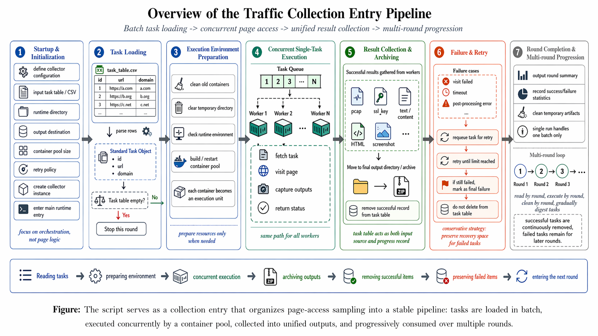
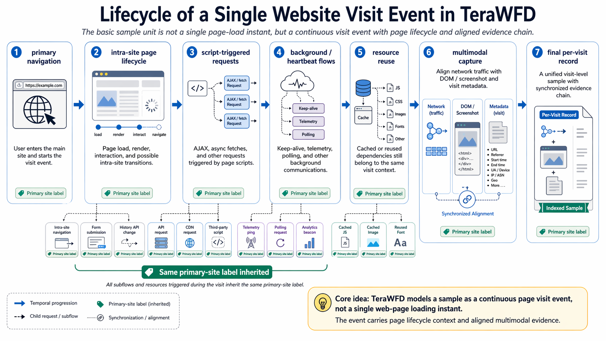

## 3 TeraWFD：网站级评测前提的设计与实现

第 2 章已经把旧 benchmark 的共同边界收束为三条前提：标签对象通常不是网站域名，样本单位通常停留在单页面或短时片段，公开载体通常只保留黑盒流量记录。本章继续回答一个更直接的问题：`SiteBench` 如何把这些前提落成可采集、可核验、可复用的数据生产过程。这里的角色边界保持固定：`TrafficIngestor` 是采集与对齐管道，`TeraWFD` 是由该管道生产出的数据载体。当前数据基础覆盖 `5,000+` 网站标签，在 `TeraWFD_NOVPN` 与 `TeraWFD_VPN` 两类切片中累计形成 `4,491` 万条有效网络流样本，总规模超过 `25TB`。

### 3.1 SiteBench 的五项可检查前提

本章先把“高质量 WF 数据集”压缩成五个可检查维度：`D1` 网站标签是否以域名为核心，`D2` 基本样本单位是否是同站连续页面访问，`D3` 协议环境是否覆盖现代 `TLS 1.3/QUIC` 与代表性封装切片，`D4` 是否保留围绕访问事件对齐的验证材料，`D5` 是否提供可复验的采集与索引路径。第 3 章回答这五项前提如何在 `TeraWFD` 中落地，第 4 章再用同一把尺子比较现有公开数据集。

`D1-D2` 落在标签对象与样本单位。本文以网站域名 `y` 作为唯一标签单位，并把同站可达页面集合 `P_y` 内的首页、导航页和内容页共同纳入样本构造。单页面样本只承担基线或对照身份；真正对应网站级识别任务的基本样本单位，是同一采集批次内按时间顺序组织的连续页面访问样本 `S_y^(b)`。研究对象因此从单页快照推进到同站连续访问过程。

标签继承遵循主页面锚定原则。对于任意宏观轨迹 `S_y`，由主页面、站内页面生命周期或其资源依赖触发的子流都继承主站标签 `y`。`D3` 也落在这一层：同一标签规则在直连 `TLS/HTTPS` 与 Trojan 单协议 case study 下的 `TLS` 外观隧道两个切片上保持一致，前者不把有限的 `SNI` 可见性升格为默认先验，后者显式保留外层封装下主请求与第三方依赖共同暴露的观测边界。共享 `CDN`、广告脚本和跨域资源因此被保留为真实任务的一部分，而不是在预处理阶段被人为剥离。

`D4-D5` 落在数据透明度与复验路径。`TeraWFD` 不只保留 `pcap`，还围绕同一访问事件同步记录 `PCAP` 流、`TLS` 会话密钥、`DOM` 快照、页面截图和访问元信息，并把它们绑定到统一事件标识、批次索引和目录路径上。它们服务于事件边界核验、误差审计和后续机制分析，使“模型到底利用了什么”不再停留在黑盒猜测层面。

### 3.2 TrafficIngestor 如何把前提落到访问事件

`TrafficIngestor` 负责把上述前提落实成可重复执行的采集链。`Figure 3` 对应系统结构，建议保留五个自左向右的主模块：任务加载、环境初始化、流量采集、数据清洗与校验、数据存储。这样的抽象层级比逐函数展开更适合作为正文图示：任务加载对应 CSV 读取、URL 与域名标签绑定和批次队列构造；环境初始化对应 Docker 容器池、浏览器运行环境、抓包目录和宿主机网络环境准备；流量采集对应浏览器访问、`tcpdump` 抓包、`TLS` 会话密钥记录以及 `DOM`、截图和文本内容同步导出；数据清洗与校验对应结果完整性检查、失败重试、临时文件清理和成功任务出队；数据存储对应按域名归档 `PCAP`、`TLS` key、`HTML`、截图、文本和元信息。整个执行链固定在客户端主机侧受控容器环境中，使浏览器运行依赖、事件级对齐和宿主机级外源噪声控制落在同一边界内。

*Figure 3. `TrafficIngestor` 通过任务加载、环境初始化、流量采集、数据清洗与校验、数据存储五个阶段，在同一事件标识下对齐浏览器执行、网络侧记录与页面侧证据。*

`Figure 4` 对应 lifecycle-level execution chain。主框架导航启动后，采集器显式轮询页面状态，等待 `DOM` 完整加载或触发硬性超时，再执行受 Web dwell-time 分析启发的页面停留[29]并关闭当前记录窗口；只有在该窗口结束后，下一页面请求才会被发出。这个“阻塞-等待-流转”状态机保留了跨页面连接复用、长连接延续和时间窗跨度，避免把多个页面请求压缩成难以解释的毫秒级并发突发。

*Figure 4. 每个访问事件在关闭当前记录窗口后才进入下一页面，从而保留逐访问对齐与跨页面时序边界。*

逐访问对齐的结果，是让 `PCAP` 流、`TLS` 会话密钥、`DOM`、截图和访问元信息共享同一访问事件标识与批次索引。研究者因此能够核验事件边界、审计异常样本、追踪误分类来源，并沿目录与索引回溯标签、页面路径、记录窗口和异常状态。换言之，第 3 章把 `D4-D5` 从口头承诺落成了访问事件级证据链；目录规范、字段索引、完整执行日志和 artifact 说明统一下放到附录或发布材料，数据共享边界与伦理治理统一留到第 6 章。
